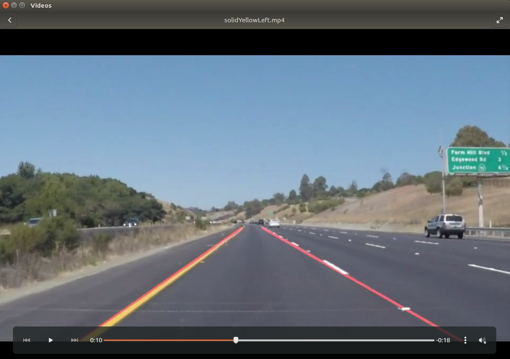
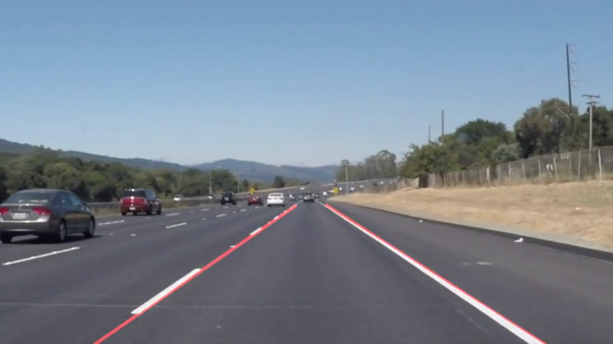
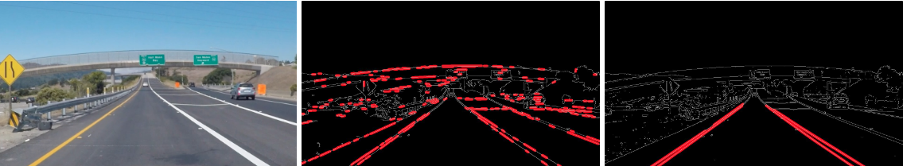

#**Finding Lane Lines on the Road** 
  
### 车道线检测项目
视频测试结果：  

  
    1. 对图像使用canny提取边缘后，圈出一定区域内的边缘线段  
    2. 然后使用霍夫曼变换连接成直线并画在原图像上  
    3. 为使检测到的车道线更平滑，将`HoughLinesP`函数得到直线分组，斜率正负的各一组，得到边界上的2点，连成直线并扩展到图片边界。 这样做能使车道线斜率更能吻合。   
    4. 然后将图片恢复成视频输出。    
  
#### 详细步骤：  
   *  1. 图像灰度处理，`cv2.cvtColor(img, cv2.COLOR_RGB2GRAY)`  
   *  2. 然后canny函数得到边缘线段`cv2.Canny(img, low_threshold, high_threshold)`  
   *  3. 加一个高斯滤波`cv2.GaussianBlur(img, (kernel_size, kernel_size), 0)`  
   *  4. 圈出一个区域，以排除干扰结果`cv2.fillPoly(mask, vertices, ignore_mask_color)`  
   *  5. 在区域内应用霍夫变换得到一组直线`cv2.HoughLinesP(img, rho, theta, threshold, np.array([]), minLineLength=min_line_len, maxLineGap=max_line_gap)`  
    6. 对直线进行处理，留下2条直线分别就是左右车道线。  

#### TODO：  
    1. Challenge视频里的阴影部分需要处理    
    2. 目前只能检测直线，需要能够适配弯道  

#### 车道检测的几种方法：
    **1. 边缘检测 + Hough线变换**    
       raw image -> Canny Gradient -> ROI -> HoughLinesP -> Road Lane Lines   
       存在问题:  
       边缘 干扰因素太多，比较依赖于手工的ROI进行过滤。  
    **2. 颜色通道 + 边缘检测 + Hough线变换：**  
       RGB2HSV后用不同阈值分别检测黄线和白线，后续流程同上。  
      存在问题： 道路曲率未知， 容易受到干扰  
    **3. Canny滤波 -> Sobel滤波 ->Hough线变换 -> 透视变换 -> stepwise搜索+多项式回归** (P4采用的方法)
       存在问题：  
       适合简单路况，复杂路况搞不定。  
       基于HoughLine和透视变换找平行线不太准  
       强光照、阴影下道路颜色超出筛选阈值  
       2条车道分别检测 不平行。  
     **4. 深度学习模型检测车道线 + 物理模型约束优化**
        2条车道线肯定是平行的，所以拿车道中心线的曲线+-C,能够拟合2条车道线。  
        车道中心线使用了一组参数组合，定义了loss函数选择最优。  
        相机重新校准：  
             1. 相机内参外参一共15个参数，通过十几张照片就能够求出这些参数。  
              外参： 目标物体与相机的距离(3*3)，旋转角度(3*1)  
              内参： 分辨率(fx  fy)、焦距(cx  cy)、偏移量  
              畸变系数、矫正方程
             
Overview
---

When we drive, we use our eyes to decide where to go.  The lines on the road that show us where the lanes are act as our constant reference for where to steer the vehicle.  Naturally, one of the first things we would like to do in developing a self-driving car is to automatically detect lane lines using an algorithm.

In this project you will detect lane lines in images using Python and OpenCV.  OpenCV means "Open-Source Computer Vision", which is a package that has many useful tools for analyzing images.  

To complete the project, two files will be submitted: a file containing project code and a file containing a brief write up explaining your solution. We have included template files to be used both for the [code](https://github.com/udacity/CarND-LaneLines-P1/blob/master/P1.ipynb) and the [writeup](https://github.com/udacity/CarND-LaneLines-P1/blob/master/writeup_template.md).The code file is called P1.ipynb and the writeup template is writeup_template.md 

To meet specifications in the project, take a look at the requirements in the [project rubric](https://review.udacity.com/#!/rubrics/322/view)

Creating a Great Writeup
---
For this project, a great writeup should provide a detailed response to the "Reflection" section of the [project rubric](https://review.udacity.com/#!/rubrics/322/view). There are three parts to the reflection:

1. Describe the pipeline

2. Identify any shortcomings

3. Suggest possible improvements

We encourage using images in your writeup to demonstrate how your pipeline works.  

All that said, please be concise!  We're not looking for you to write a book here: just a brief description.

You're not required to use markdown for your writeup.  If you use another method please just submit a pdf of your writeup. Here is a link to a [writeup template file](https://github.com/udacity/CarND-LaneLines-P1/blob/master/writeup_template.md). 

The Project
---

## If you have already installed the [CarND Term1 Starter Kit](https://github.com/udacity/CarND-Term1-Starter-Kit/blob/master/README.md) you should be good to go!   If not, you should install the starter kit to get started on this project. ##

**Step 1:** Set up the [CarND Term1 Starter Kit](https://classroom.udacity.com/nanodegrees/nd013/parts/fbf77062-5703-404e-b60c-95b78b2f3f9e/modules/83ec35ee-1e02-48a5-bdb7-d244bd47c2dc/lessons/8c82408b-a217-4d09-b81d-1bda4c6380ef/concepts/4f1870e0-3849-43e4-b670-12e6f2d4b7a7) if you haven't already.

**Step 2:** Open the code in a Jupyter Notebook

You will complete the project code in a Jupyter notebook.  If you are unfamiliar with Jupyter Notebooks, check out <A HREF="https://www.packtpub.com/books/content/basics-jupyter-notebook-and-python" target="_blank">Cyrille Rossant's Basics of Jupyter Notebook and Python</A> to get started.

Jupyter is an Ipython notebook where you can run blocks of code and see results interactively.  All the code for this project is contained in a Jupyter notebook. To start Jupyter in your browser, use terminal to navigate to your project directory and then run the following command at the terminal prompt (be sure you've activated your Python 3 carnd-term1 environment as described in the [CarND Term1 Starter Kit](https://github.com/udacity/CarND-Term1-Starter-Kit/blob/master/README.md) installation instructions!):

`> jupyter notebook`

A browser window will appear showing the contents of the current directory.  Click on the file called "P1.ipynb".  Another browser window will appear displaying the notebook.  Follow the instructions in the notebook to complete the project.  

**Step 3:** Complete the project and submit both the Ipython notebook and the project writeup

