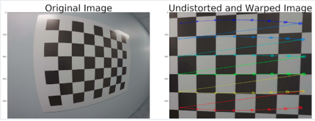
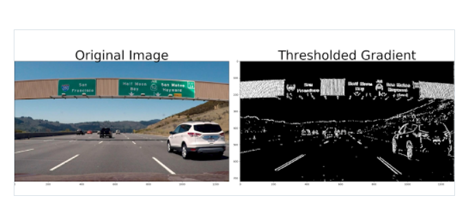
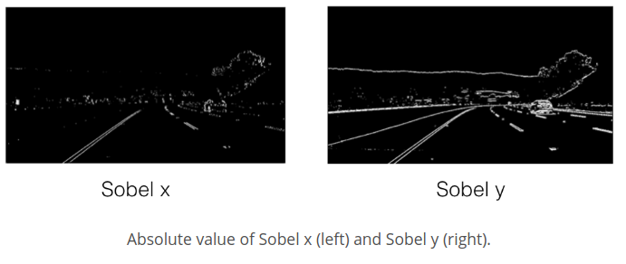
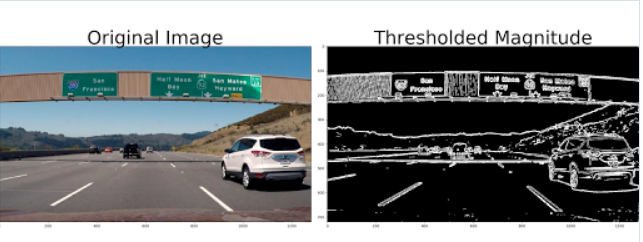
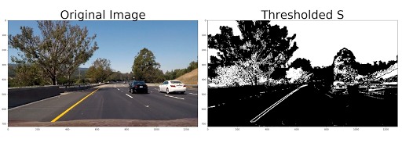
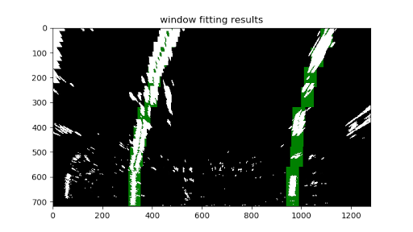

## Camera Calibration with OpenCV

0. camera_calibration.ipynb
    相机校准练习.
1. undistort_trans.py  
    对图片进行失真修复和透视变换  
      
2. sobel.py  
    用sobel函数计算图片x方向梯度  
      
    sobel 在x和y方向的对比:
      
3. magnitude_grad.py  
    计算x和y方向梯度的距离,并加入了梯度的阈值,可以看到结果比只用sobel要好  
      

4. dir_thresh.py  
    计算梯度的方向,并用阈值过滤.
    由于车道线与车的夹角基本固定,可以通过计算梯度的夹角来检测: arctan(sobel ​y /sobel x). 这个想法很好哎.
      
    但实际结果并不是很好,需要配合其他一起使用.
5. 混合上面的方法:
```python
    combined = np.zeros_like(dir_binary)  
    combined[((gradx == 1) & (grady == 1)) | ((mag_binary == 1) & (dir_binary == 1))] = 1  
```

6. 颜色空间  
    RGB HLS  HSV  
    R空间通常对线条亮度有作用  
    S通道效果也很好.
```python
    thresh = (200, 255)
    binary = np.zeros_like(R)
    binary[(R > thresh[0]) & (R <= thresh[1])] = 1
```
     
    可以看到效果确实很好
7. rgb_to_hls.py  
    使用cv2.COLOR_RGB2HLS将rgb空间的图像转到hls,然后取S通道
     
8. sliding_window_search.py  
    在经过透视变换后的图片上使用滑动框,搜索车道线.
    使用np.sum将图片y方向的像素累加,得到一个y方向上像素分布. 以中心线为界,左右2边累加值最大的即为2条车道线x中心位置.
    找到左右车道的两个起始位置，用一个固定大小的框去slide.
     


The IPython notebook in this repository contains code to calculate the camera matrix and distortion coefficients using the images in the "calibration_wide" folder.

